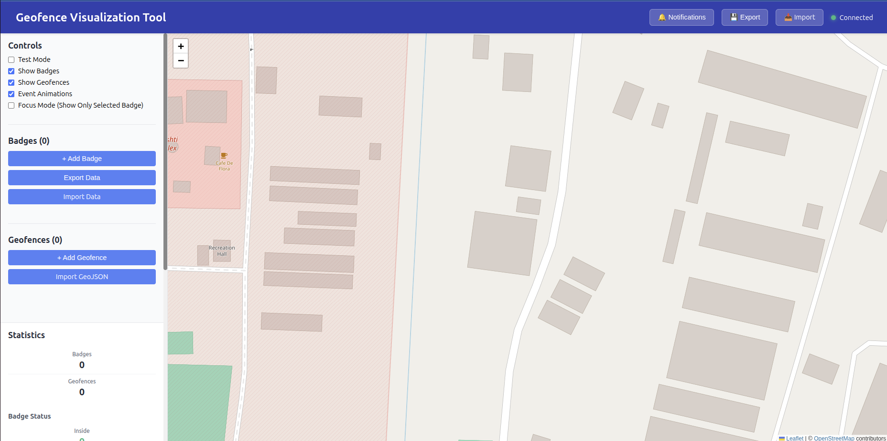
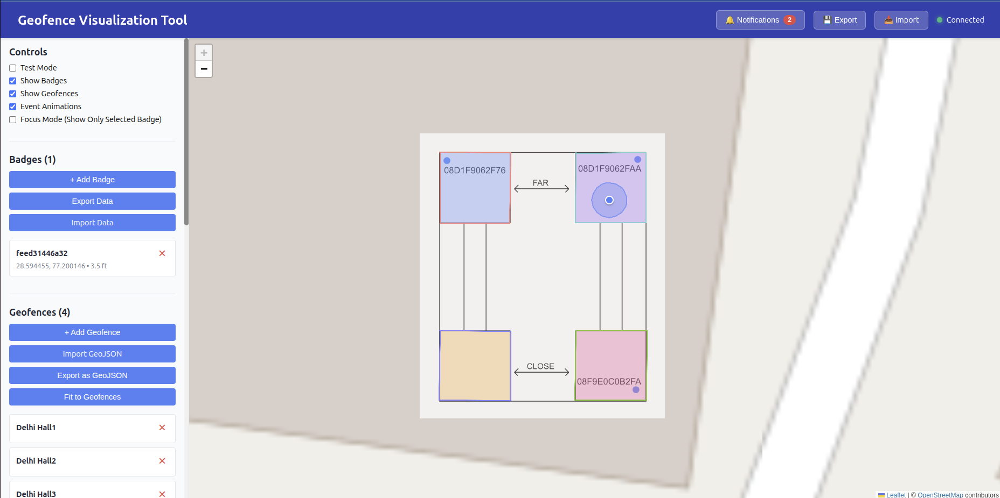
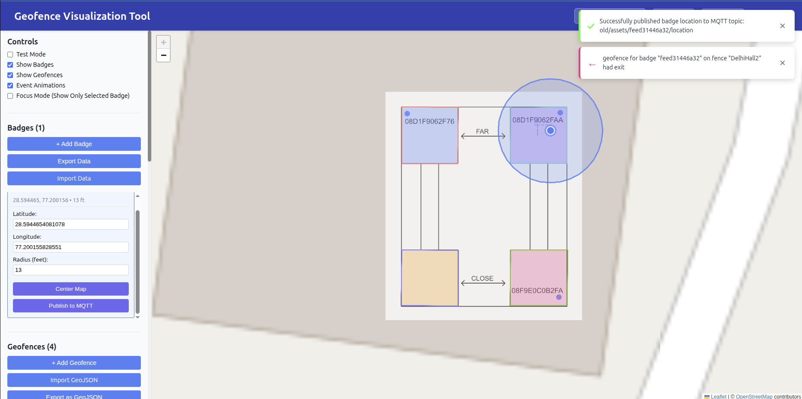

# Geofence Visualization Tool - Usage Guide

## Quick Start

1. Visit: https://geofence-visualizer.onrender.com
   
   > **Note:** The app may take a couple of minutes to load on first visit (Render free tier spins down after inactivity).

   

2. Click the **Import** button (top right) and select the [Delhi config file](./Delhi-visualizer-config.json) (contains floor image and GeoJSON setup)
   
   Click **OK** when prompted

3. Publish a test location update (requires `mosquitto` client):
   ```bash
   mosquitto_pub -h iot.mongrov.net -t "old/assets/feed31446a32/location" \
     -m '{"mac":"feed31446a32","latitude":28.5944654081078,"longitude":77.200155828551,"radius":3}'
   ```

4. Zoom in to see the floor visualization:

   

## Simulating Device Movement

1. Under **Badges(1)**, select the badge you want to move
2. Update **Latitude**, **Longitude**, and **Radius (feet)**
3. Click **Publish to MQTT**

This mimics real device location updates that the Rapids System processes. The Geofencing module checks for violations and sends updates to the geofence queue, which appear as notifications in the tool:


